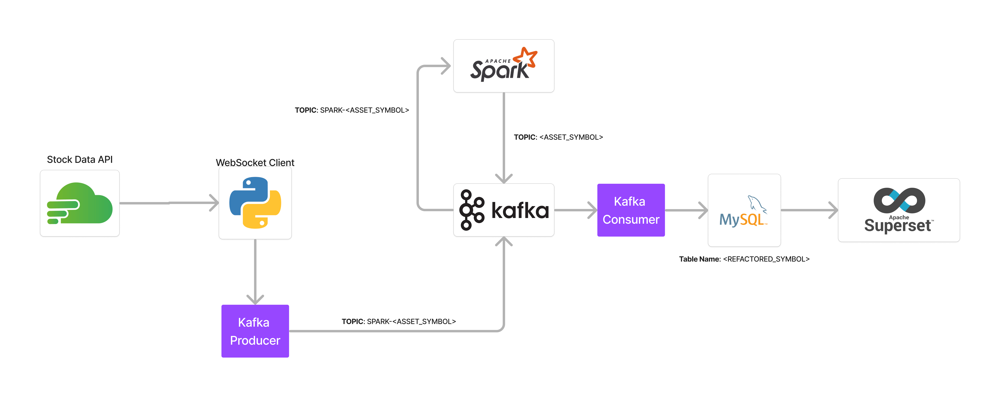
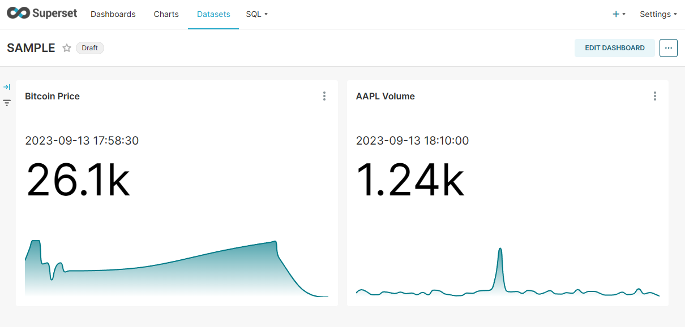

# Streaming Analysis Data Pipeline
## Introduction
This project is a streaming analysis data pipeline that ingests data from a Kafka topic, processes the data using Spark, and writes the results to a MySQL database. Visualization of the data can be done using Apache Superset.

## Pipeline Architecture

- **Kafka**: A distributed streaming platform that allows for the publishing and subscribing to streams of records. In this project, Kafka is used to ingest data from a WebSocket server. Specifically, the data is ingested from the [Finnhub](https://finnhub.io/) WebSocket server. 

- **Spark**: A unified analytics engine for large-scale data processing. In this project, Spark is used to process the data from Kafka and write the results to a MySQL database. 

- **MySQL**: A relational database management system. In this project, MySQL is used to store the results of the Spark job.

- **Superset**: A modern, enterprise-ready business intelligence web application. In this project, Superset is used to visualize the data in the MySQL database by creating dashboards.

- All of the above services are containerized using Docker and orchestrated using Docker Compose.

## Pipeline Working
1. Docker Compose is used to build and run the services.

2. The Spark job is started and the required asset symbols are passed as arguments. The Spark job consumes the data from the Kafka topic, processes the data, and writes the results as a Kafka topic. \
The Spark job will idle until the tables are setup and the stock producer is started.

3. The DB consumer script is started passing the topic (refactored asset symbols) as an argument. The DB consumer script consumes the data from the Kafka topic and writes the data to the MySQL database. \
This script also creates the tables in the MySQL database if it doesn't exist for the asset. 

4. The stock producer is started and the required asset symbols are passed as arguments. The stock producer connects to the Finnhub WebSocket server and publishes the data to the Kafka topic.

5. The Superset service is already running and can be accessed at `localhost:8088`. The MySQL database needs to be added as a datasource and the tables need to be added as tables in Superset. The data can be visualized by creating dashboards in Superset. \
Here is an example of a dashboard created in Superset:

## Setup
### Prerequisites
- Docker
- Docker Compose
- Python 3.11
- Anaconda/Miniconda

### Steps
1. Clone the repository.
2. Create a conda environment with python 3.11.
3. Install `pyspark`, `mysql-connector-python`, `kafka-python`, and `websocket-client` using pip.
4. Run `docker-compose up` to build and run the services.
5. Run the spark_streaming.py script to start the Spark job. The required asset symbols need to be passed as arguments.
6. Run the db_consumer.py script to start the DB consumer. The topic (*refactored asset symbols) needs to be passed as an argument.
7. Run the stock_producer.py script to start the stock producer. The required asset symbols need to be passed as arguments.

*Note*: Make sure to use a linux based OS. Pyspark on windows is a complete mess. But if you really want to use windows, look up how to install winutils and set the HADOOP_HOME environment variable. 

* Refactored asset symbols: The asset symbols need to be refactored to match Kafka's naming conventions. For example, the asset symbol `BITNAMI:BTCUSD` needs to be refactored to `BITNAMI_BTCUSD`. 